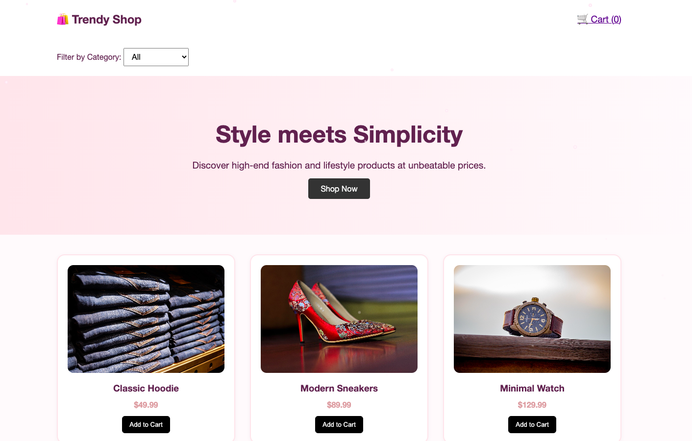

# 🛒 E-Commerce Website

A responsive e-commerce website showcasing modern product layouts, clean UI design, and a foundation for online shopping functionality.

---

## 🚀 Live Demo

👉 [🔗 View Live Website](https://trinityray02.github.io/E-commere-Website/)

---

## 📸 Preview



---

## ✨ Features

- Responsive product layout
- Clean and modern UI design
- Product cards with images and descriptions
- Organized page structure for scalability
- Mobile-friendly design

---

## 🛠️ Tech Stack

- HTML5
- CSS3
- JavaScript

---

## 📁 Project Structure

- index.html
- style.css
- script.js
- images/


---

## ▶️ How to Run Locally

1. Clone the repository:
   ```bash
   git clone https://github.com/trinityray02/E-commere-Website.git

2. Open the project folder
3. Open:
     index.html

👩‍💻 Author
Trinity Ray

⭐ Notes
This project demonstrates my ability to design and structure an e-commerce interface and serves as a foundation for building full-stack applications in the future.
